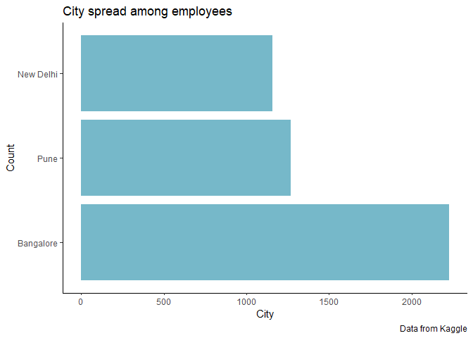
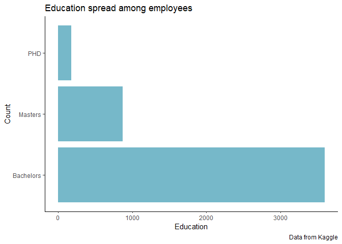
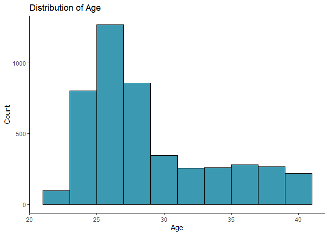
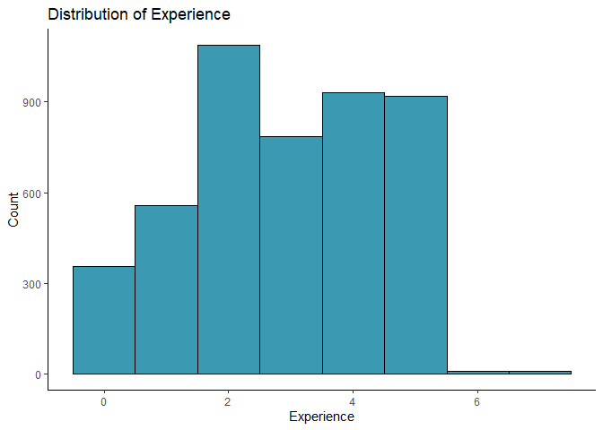
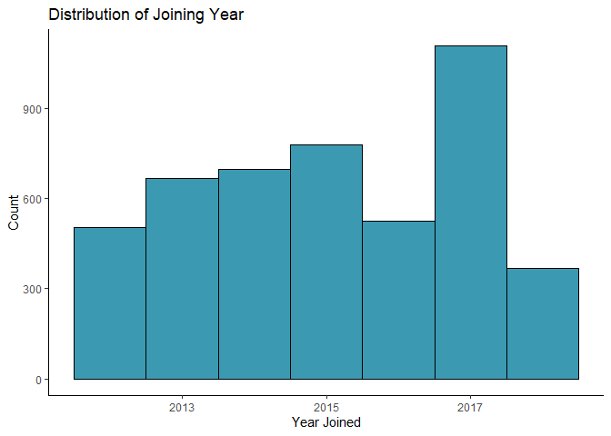
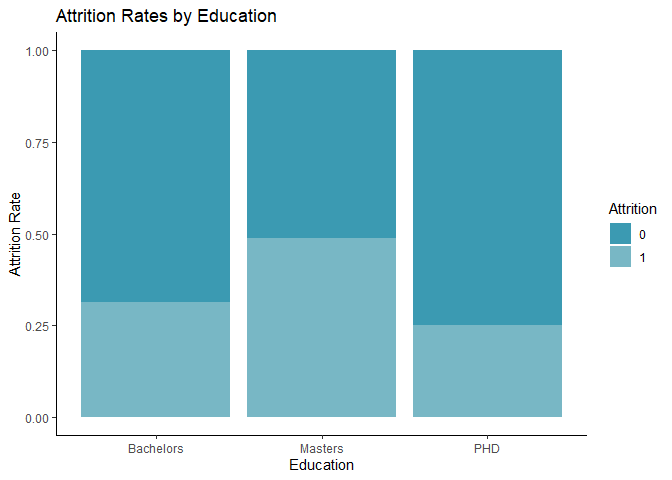
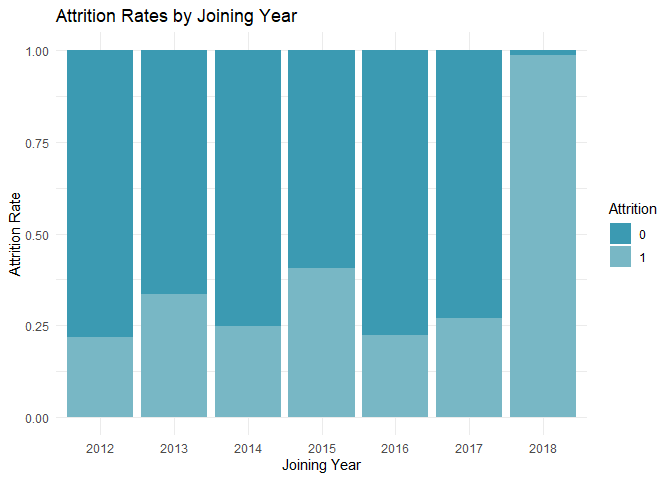

# Purpose

This contains some data work for my machine learning project on employee
attrition. See the “Final Project” folder for the complete RMD file and
PDF output for the project.

``` r
rm(list = ls()) # Clean your environment:
gc() # garbage collection - It can be useful to call gc after a large object has been removed, as this may prompt R to return memory to the operating system.
```

    ##          used (Mb) gc trigger (Mb) max used (Mb)
    ## Ncells 466462 25.0    1002554 53.6   660388 35.3
    ## Vcells 862796  6.6    8388608 64.0  1769776 13.6

``` r
library(tidyverse)
```

    ## ── Attaching core tidyverse packages ──────────────────────── tidyverse 2.0.0 ──
    ## ✔ dplyr     1.1.2     ✔ readr     2.1.4
    ## ✔ forcats   1.0.0     ✔ stringr   1.5.0
    ## ✔ ggplot2   3.4.2     ✔ tibble    3.2.1
    ## ✔ lubridate 1.9.2     ✔ tidyr     1.3.0
    ## ✔ purrr     1.0.1     
    ## ── Conflicts ────────────────────────────────────────── tidyverse_conflicts() ──
    ## ✖ dplyr::filter() masks stats::filter()
    ## ✖ dplyr::lag()    masks stats::lag()
    ## ℹ Use the conflicted package (<http://conflicted.r-lib.org/>) to force all conflicts to become errors

``` r
list.files('code/', full.names = T, recursive = T) %>% .[grepl('.R', .)] %>% as.list() %>% walk(~source(.))
```

First I read in the data

``` r
employee <- read.csv("C:/Users/hanna/OneDrive/Documents/Data Science/Project/EmployeeProject/data/Employee.csv")

library(tidyverse)

#spread of data across city and education
pacman::p_load(forcats)

library(wesanderson)
```

    ## Warning: package 'wesanderson' was built under R version 4.3.1

``` r
palette <- wes_palette("Zissou1", 2)
palette2 <- wes_palette("Zissou1", 1)

source("Final_Project/code/plot_spread.R")
spread <- plot_spread(employee, City)
spread
```

<!-- -->

``` r
spread_ed <- plot_spread(employee, Education)
spread_ed
```

<!-- -->

``` r
#distribution
age_plot <- ggplot(employee, aes(x = Age)) +
  geom_histogram(binwidth = 2, fill = palette2, color = "black") +
  labs(x = "Age", y = "Count")  +
  ggtitle("Distribution of Age") + theme_classic()
age_plot
```

<!-- -->

``` r
exp_plot <- ggplot(employee, aes(x = ExperienceInCurrentDomain)) +
  geom_histogram(binwidth = 1, fill = palette2, color = "black") +
  labs(x = "Experience", y = "Count") +
  ggtitle("Distribution of Experience") +theme_classic()
exp_plot
```

<!-- -->

``` r
year_plot <- ggplot(employee, aes(x = JoiningYear)) +
  geom_histogram(binwidth = 1, fill = palette2, color = "black") +
  labs(x = "Year Joined", y = "Count") +
  ggtitle("Distribution of Joining Year") +theme_classic()
year_plot
```

<!-- -->

``` r
#Attrition Rate
educ_plot <- ggplot(employee, aes(x = Education, fill = factor(LeaveOrNot))) +
  geom_bar(position = "fill") + scale_fill_manual(values = palette) +
  labs(x = "Education", y = "Attrition Rate", fill = "Attrition") +
  ggtitle("Attrition Rates by Education") + theme_classic()
educ_plot
```

<!-- -->

``` r
year_att_plot <- ggplot(employee, aes(x = factor(JoiningYear), fill = factor(LeaveOrNot))) +
  geom_bar(position = "fill") +
  labs(x = "Joining Year", y = "Attrition Rate", fill = "Attrition") + scale_fill_manual(values = palette) +
  ggtitle("Attrition Rates by Joining Year") + theme_minimal()

year_att_plot
```

<!-- -->

# Engineering

``` r
#create a binary variable for gender - female is 0 and male is 1
employee <- employee %>%
  mutate(male = ifelse(Gender == "Female", 0, 1))

#create a binary variable for ever-benched - i.e., they kept out of projects for a month or more
employee <- employee %>%
  mutate(benched = ifelse(EverBenched == "No", 0, 1))

#One hot encoding
employee <- employee %>%
  mutate(bangalore = ifelse(City == "Bangalore", 1, 0)) %>% 
    mutate(pune = ifelse(City == "Pune", 1, 0)) %>% 
    mutate(new_delhi = ifelse(City == "New Delhi", 1, 0))

#lable encode education category where Bachelors =1, Master's =2 and PhD = 3
employee <- employee %>%
  mutate(education = case_when(
    Education == "Bachelors" ~ 1,
    Education == "Masters" ~ 2,
    Education == "PHD" ~ 3
  ))

#one-hot encode joining year
data <- data.frame(JoiningYear = c("2014", "2015", "2016", "2017", "2018"))

employee <- employee %>%
  mutate(Y2014 = ifelse(JoiningYear == "2014", 1, 0)) %>% 
    mutate(Y2015 = ifelse(JoiningYear == "2015", 1, 0)) %>% 
    mutate(Y2016 = ifelse(JoiningYear == "2016", 1, 0)) %>% 
    mutate(Y2017 = ifelse(JoiningYear == "2017", 1, 0)) %>% 
     mutate(Y2018 = ifelse(JoiningYear == "2018", 1, 0))
```

# Logistic model, KNN model, and Random Forests code can be found in the RMD under “final project”. Please look there for coding and output.
